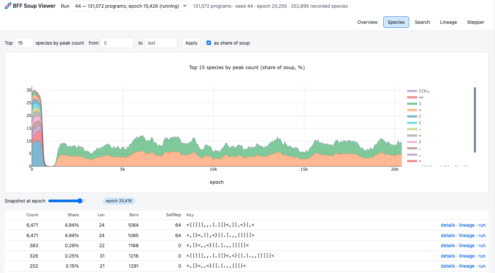
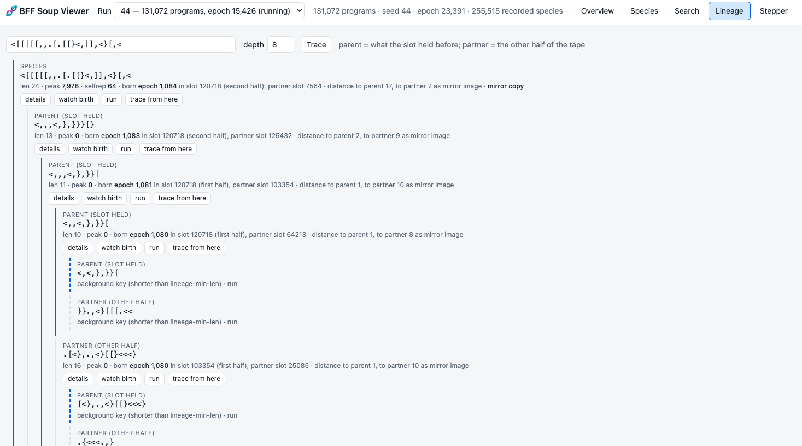

# BFF Primordial Soup

> **This is a fork** of [gustavsoderstrom/computational-life](https://github.com/gustavsoderstrom/computational-life). The original is a compact Python re-implementation of the BFF experiment from ["Computational Life: How Well-formed, Self-replicating Programs Emerge from Simple Interaction"](https://arxiv.org/abs/2406.19108) (Agüera y Arcas et al., 2024). This fork turns it into an analysis toolchain. New code is MIT licensed (see `LICENSE`).

A soup of random 64-byte programs is repeatedly paired up. Each pair is executed as one 128-byte tape in a Brainfuck dialect (BFF) whose instructions read and write the tape itself, then split again. There is no fitness function and, by default, no mutation. Sooner or later a program appears that copies itself into its partner, and the soup changes character: entropy, bits per byte and species counts all jump. This repository lets you run that experiment at the paper's scale, watch it live, search the soup for a program, trace a replicator's ancestry back to the epoch it first appeared, replay any birth event step by step in the browser, and compare what emerged across runs.



**What the fork adds**

- A replay-exact simulator: every epoch's pairing derives from the seed, slots are stable identities, and a resumed run reproduces the uninterrupted one byte for byte.
- Lineage recording while the run goes: which slot produced which key, from which two parents, at which epoch.
- A query layer and CLI: exact, substring, regex and fuzzy search; species history; ancestry trees with mirror-copy detection; exact replay of any epoch.
- A local web viewer with overview charts, species dynamics, search, lineage trees and an animated BFF stepper.
- Per-run archives (winners, families, emergence story) and a cross-run comparison tool.
- An interpreter about 8x faster than the original on a mature soup, with results proven identical.

## Quick start

```bash
python3 -m venv .venv && source .venv/bin/activate      # Python 3.11+
pip install -r requirements.txt                          # numpy, numba, brotli

# A statistics run: 131072 programs, the paper's step budget, sampled metrics, stops once the outcome is
# clear (takeover, extinction after emergence, or 32k unresolved epochs), capped at 100k epochs.
# The run is named <host>-<date>-<letter>.
# On an M4 Pro this runs at 60+ epochs/s before replicators appear and slows during takeover.
python3 bff_soup.py --stats

# In other terminals: terminal monitor, or the web viewer on http://localhost:8765/
python3 visualize_bff.py runs/<name>
python3 bff_web.py

# When the run ends (or is stopped with Ctrl-C) its archive is written to archive/<host>-<name>.json
python3 bff_compare.py --survival
```

Transitions are a matter of luck and patience: the paper reports about 40% of 131k-program runs transitioning within 16k epochs. Runs 42 and 43 of this fork ran 43k and 60k epochs without one; run 44 produced a replicator pair at epoch 1084.

## The experiment

### How it works

1. Start with a soup of random 64-byte programs. Only 10 of 256 byte values are instructions, so about 4% of bytes do anything; the rest are data.
2. Each epoch, pair the programs at random and concatenate each pair into a 128-byte tape.
3. Execute the tape. Programs can modify themselves and each other.
4. Split the tape back into its two slots.
5. Repeat. Eventually self-replicators emerge and spread.

### BFF instruction set

BFF replaces Brainfuck's I/O with copying between two heads on a shared tape:

| Command | Description |
|---------|-------------|
| `>` `<` | Move head0 right / left |
| `}` `{` | Move head1 right / left |
| `+` `-` | Increment / decrement the byte at head0 |
| `.` | Copy the byte at head0 to head1 |
| `,` | Copy the byte at head1 to head0 |
| `[` | Jump past the matching `]` if the byte at head0 is 0 |
| `]` | Jump back to the matching `[` if the byte at head0 is not 0 |

### Execution semantics

Both heads and the program counter start at 0; heads wrap modulo 128; non-instruction bytes are skipped. This is cubff's `bff_noheads`. With `--heads` (cubff's `bff`) the first two tape bytes set the initial head positions and execution starts at byte 2, which lets a program carry its own head settings and breaks the symmetry between the two tape positions (see below). A tape stops when the program counter leaves the tape, a bracket is unmatched, or the step budget (`--max-steps`; the paper uses 8192) is spent.

The interpreter also stops a program that is **provably stuck**: once the tape has stopped changing, the machine state is just (program counter, head0, head1), and if that state recurs the program loops forever without writing again, so the tape is already final. This is detected with Brent's cycle algorithm and yields exactly the same tapes as running out the budget (`tests/test_kernel.py` checks it against a plain reference interpreter), about 9x faster on a mature soup where most tapes spin. The only visible effect is that "instructions per tape" counts useful work rather than spinning.

### Emergent replicators

A replicator that emerges often has a palindrome-like shape, for example

```
{[<},]],}<[{
```

`{` moves head1 left (wrapping to position 127), then `[<},]` is the copy loop: move the destination head0 left, move the source head1 right, copy from head1 to head0, and repeat while the byte under head0 is non-zero. When two programs meet on a tape,

```
|  Program A (0-63)  |  Program B (64-127)  |
     head1 (source)      head0 (destination)
```

the replicator copies itself backwards into the other program's space, and the near-mirror structure keeps a valid copy loop whichever way the tape is cut.

**Position symmetry and why replicators can fade.** With heads starting at 0, a program cannot tell which half of the tape it occupies. A copy loop that writes the program over its partner when the program runs first will, when the partner's code falls through into it, write the partner over the program. Replays of a run whose replicator rose to 31% and then declined showed births per instance equal to deaths per instance to three decimals at every stage: the population is a random walk with zero drift, and can drift out of existence. Takeovers happen when the balance tips by a few percent. The `--heads` variant is the natural test of this explanation.

Run 44 of this fork produced a variant of this mechanism: a 24-instruction program, `<[[[[[,,.[.[[}<,]],<}[,<`, that writes its **mirror image** into the partner whenever it is the first half of the tape, and never copies as the second half. Its population therefore alternates between the key and its reverse, in lockstep, and hovered around 10% of the soup instead of taking over. The tooling recognises mirror copies in lineage traces and merges mirror pairs into one family.

## The simulator

### Run directory

Every run writes to `runs/<seed>` (or `--run-dir`):

| Path | Content |
|------|---------|
| `meta.json` | All parameters, resume history, stop-condition events, recording statistics |
| `log.csv` | Per-epoch metrics: compressed size, higher-order entropy, H0, bits/byte, instructions per tape, unique species, top species share and key length, key changes, candidate and recorded births, self-replicating slots, elapsed time |
| `checkpoints/*.dat` | The soup every `--checkpoint-interval` epochs (JSON header + raw bytes). File `0` is the initial soup, file `e` the soup after epoch `e`. |
| `changes.bin` | Change records (epoch, slot, partner slot, new key hash) for slots that changed to a recorded species, plus every slot at epoch 0 |
| `species.db` | SQLite: recorded species with their birth event, key texts of snapshot species, species counts every `--species-interval` epochs, self-replication scores |
| `pending.npz` | The recorder's rolling window, saved on exit so a resume from the final checkpoint continues exactly |

Run directories are large (about 8 MB per checkpoint) and are not committed; the durable output is the archive, see below.

### Program identity and what gets recorded

Programs are identified by their **key**: the program with all non-instruction bytes removed. Slots are stable identities, so the change records of one slot form its line of descent. A species' **birth** is the first execution that produced its key; the birth row stores the epoch, the slot, the partner slot, and the keys both tape halves held before the execution (the "parent", what the slot held, and the "partner").

An active pre-transition soup produces tens of thousands of never-repeated keys per epoch, so births are held in a rolling window of `--lineage-window` epochs and a species is written to the database only once it occupies `--promote-count` slots at the same time, together with its pending ancestors (nearest first, up to `--cascade-depth` generations and `--cascade-max` rows). Keys shorter than `--lineage-min-len` instructions are the random background and are never tracked individually, but their text is stored wherever they are the parent of a recorded species. Change records are kept only for recorded species, up to `--lineage-budget-mb`. The promotion flags may be changed when resuming.

### Determinism and resuming

Seeds may be numbers or names: a name such as `mini-15` is hashed to a 64-bit integer, is reproducible on every machine, and names the run directory, which keeps runs from different machines apart. The pairing of every epoch derives from `(seed, epoch)`, so a run resumed from any checkpoint reproduces exactly the trajectory the uninterrupted run would have taken. Resuming keeps the run's recorded settings; only `--epochs`, the stop conditions, `--print-interval` and the recording policy flags apply. Resuming from the final checkpoint of a stopped run restores the recorder's window too, so the result is identical to an uninterrupted run; from an earlier checkpoint the window starts empty (noted in `meta.json`).

```bash
python3 bff_soup.py --resume runs/44 --epochs 80000                 # latest checkpoint
python3 bff_soup.py --resume runs/44/checkpoints/0000010240.dat     # a specific one
```

### Command-line options

```
simulation:
  --stats               Preset: 131072 programs, 8192 steps, sampled metrics, --stop-outcome
                        --stop-after 2048, cap 100000 epochs (explicit flags win)
  --num N               Number of programs, even (default: 1024)
  --epochs N            Run until this epoch number (default: 10000)
  --seed S              Random seed: a number, or any name (hashed; also the run's name).
                        Default: <host>-<date>-<letter>
  --heads               The paper's 'bff' variant: first two tape bytes set the heads, execution starts at byte 2
  --mutation-prob P     Per-byte mutation probability per epoch (default: 0; paper: 0.000244).
                        Given on resume, changes the rate from that epoch on: an experiment on the
                        old soup (recorded in meta.json; the protocol label gets '-resumed')
  --max-steps N         Step budget per tape execution (default: 32768; paper: 8192)
  --seed-programs F.npy[:N]  Plant N copies of the programs in F (n x 64 uint8) into random slots
output:
  --run-dir DIR         Run directory (default: runs/<seed>)
  --resume PATH         Run directory or checkpoint file to resume from
  --checkpoint-interval N   Epochs between checkpoints (default: 256)
  --species-interval N  Epochs between species-count snapshots (default: 32)
  --selfrep-interval N  Epochs between self-replication tests (default: 256)
  --selfrep-top K       Most common species to test (default: 512)
  --lineage-min-len L   Track births only for keys with >= L instructions (default: 8)
  --lineage-window N    Epochs a birth is remembered while waiting to be promoted (default: 128)
  --promote-count K     Record a species once it occupies K slots at once (default: 6)
  --cascade-depth D     Generations of pending ancestors recorded with it (default: 12)
  --cascade-max M       Ancestors recorded per promotion, nearest first (default: 24)
  --lineage-budget-mb M Stop appending change records at this file size (default: 2048)
  --metric-interval N   Epochs between compression metrics (default: 1)
  --metric-sample N     Programs to compress for the metrics (default: 0 = whole soup)
  --no-archive          Do not build the run archive on exit
  --archive-dir DIR     Where archives go (default: archive/, or $BFF_ARCHIVE_DIR)
  --protocol NAME       Label of the setup for statistics (default: derived, e.g. 128k-8192-mut)
stop conditions (optional):
  --stop-entropy X      Stop when higher-order entropy exceeds X (may fire a few epochs late)
  --stop-share X        Stop when one species exceeds X percent of the soup
  --stop-selfreps N     Stop when at least N slots hold a self-replicator
  --stop-outcome        After emergence (replicators in 1% of the soup): stop on takeover (half the soup for
                        2048 epochs), extinction (none for 1024 epochs) or 32768 unresolved epochs
  --stop-after N        Keep running N more epochs after a stop condition fires
```

### Performance notes

The interpreter runs in parallel on all cores (Numba); the recorder and metrics run alongside it, with compression in background threads. Per epoch on a 131k soup: interpreter 7-25 ms depending on activity, recorder 5-15 ms depending on how many new keys appear.

- `--max-steps 8192` (the paper's value) makes a busy soup about 4x cheaper than the original default of 32768.
- `--metric-sample 32768` compresses a 2 MB sample instead of the whole 8 MB soup; the entropy value differs by a few thousandths and the metric leaves the critical path.
- Memory is dominated by the recorder's window: roughly candidates-per-epoch x window x 224 bytes, typically 1-4 GB at 131k programs.
- Two runs in parallel should each get half the cores: `NUMBA_NUM_THREADS=6 python3 bff_soup.py ...`.

## Analysis tools

### Web viewer

```bash
python3 bff_web.py                 # serves runs/ on http://localhost:8765/ and opens a browser
python3 bff_web.py --runs runs --port 8765 --no-browser
```

Works while a simulation is running; the overview auto-refreshes.



| Tab | What it shows |
|-----|---------------|
| Overview | Entropy, bits per byte, instructions per tape, unique species, top species share and self-replicator count over time, with the transition marked and a zoomable range |
| Species | Stacked area of the top species over time (Muller-style) and a snapshot table at any recorded epoch with details / lineage / run links |
| Search | Exact, substring, regex or fuzzy (edit distance) search over recorded species, or over the keys present in a checkpoint. A result opens its birth event, count history and self-replication history. |
| Lineage | Ancestry tree of a species: where and when it was born, which key the slot held before ("parent") and which key shared the tape ("partner"), with edit distances marking the primary ancestor and mirror copies labelled |
| Stepper | Animated BFF interpreter: load two programs by hand, run a species against random partners, or replay the exact tape on which a species was born, then step through it with the program counter and both heads highlighted. "A from soup" / "B from soup" replace a typed key by the raw bytes of a real instance from a checkpoint (real data bytes matter to copy loops); "Next generation" moves the second half into the first and pairs it with fresh random bytes; "Test self-replication" runs the cubff test on both halves. |

### Command line

```bash
python3 bff_query.py info    runs/44
python3 bff_query.py top     runs/44 --epoch 5000 --n 20                 # most common species at a snapshot
python3 bff_query.py search  runs/44 ',<}[[.[.,,' --mode substring      # also exact | regex | fuzzy --max-dist 2
python3 bff_query.py search  runs/44 '<,,,}' --epoch 2048               # keys in the checkpoint at/below that epoch
python3 bff_query.py species runs/44 '<[[[[[,,.[.[[}<,]],<}[,<'         # birth event, counts, selfrep history
python3 bff_query.py lineage runs/44 '<[[[[[,,.[.[[}<,]],<}[,<' --depth 8
python3 bff_query.py slot    runs/44 120718 --before 1100 [--trace]     # what one slot held over time
python3 bff_query.py tape    runs/44 --epoch 1084 --slot 120718         # exact tape before/after, replayed
python3 bff_analysis.py runs/44 --top 10                                # most common programs in the latest checkpoint
python3 visualize_bff.py runs/44 [--last 500]                           # terminal monitor (also reads cubff logs)
```

Add `--json` before a `bff_query.py` subcommand for machine-readable output. Replaying a tape re-executes the epochs since the nearest checkpoint (up to 256), which takes seconds on a 131k soup and competes with a running simulation for CPU.

**Lineage semantics.** The *parent* is what the slot held before the birth execution and the *partner* is the other half of the tape; whichever is closer by edit distance is marked primary. Distances are also computed against the reversed keys, because a replicator often writes its mirror image into the partner; such births are labelled mirror copies. Ancestors older than the recording window when a species was promoted are not recorded, but their text is stored in the child's birth row, so a chain never ends blind.

**Self-replication score** (from cubff): the program is paired with 13 random partners and run for 5 generations each; the score is the number of tape bytes that stay stable. 5 or more counts as a replicator; a perfect replicator scores 64. Note that an organism is its whole 64 bytes: the same instruction string padded with zeros usually does not replicate, because the loops read the data bytes under the heads.

### Run archives and cross-run analytics

The run directory is a large working set. The durable output of a run is its **archive**, one JSON file of a few hundred KB written to `archive/<run>.json` when the simulation finishes or is stopped (or with `python3 bff_archive.py runs/44` at any time). Archives are not committed to this repository. An archive contains:

- run facts and event epochs: emergence (self-replicators in 1% of the soup), transition (the earliest of: entropy > 3, half the soup holding self-replicators, distinct keys below 5% of the soup), first self-replicator, top-species share crossings
- the top 20 species at the end and at 256, 1024 and 4096 epochs after the transition, each with raw bytes, share, self-replication score and birth
- **families**: the winners clustered into variants of one core (edit distance ≤ 3, up to reversal), with a functional profile of the representative: instruction usage, writing head, instructions per execution, faithful generations, direct or mirror copying
- the emergence story: the ancestry tree of each family's representative, and for the five leading families the exact tapes of the birth events along the primary ancestor line
- the metrics log, decimated, at full resolution around the transition

```bash
python3 bff_compare.py                 # table of all archived runs
python3 bff_compare.py --survival      # fraction transitioned by epoch, per protocol (censoring-aware)
python3 bff_compare.py --families      # leading family cores across runs, recurring cores, edit distances
python3 bff_compare.py --csv runs.csv  # one row per run
```

**Collecting statistics across machines.** Archives are named `<host>-<seed>.json` and carry the host, the parameters and a **protocol** label derived from them (for example `128k-8192`, `128k-8192-mut` or `128k-8192-heads`; override with `--protocol`), so runs from several machines can be grouped. Point the simulator at a shared collection with `--archive-dir` or `BFF_ARCHIVE_DIR`, for instance a clone of the [results repository](https://github.com/peterseb1969/computational-life-results), and commit the archive when a run ends. For statistics let runs stop themselves: the `--stats` preset uses `--stop-outcome`, which waits for the story to end after self-replicators first hold 1% of the soup: a takeover held for 2048 epochs, an extinction (no self-replicator for 1024 epochs, as after a parasite), or 32768 unresolved epochs of coexistence. The archive dates both the **emergence** (replicators at 1%) and the **transition** (entropy above 3, replicators in half the soup, or distinct keys below 5%), and `bff_compare.py --survival` shows both curves. A run that reaches the epoch cap without the event is a censored observation.

## Findings

Write-ups of what the runs showed live in `docs/findings/`; the run archives they rest on are published in [computational-life-results](https://github.com/peterseb1969/computational-life-results):

- [A parasite kills the first life in a BFF soup](docs/findings/parasite-macbook-1.md): emergence at 49k epochs, a loopless variant that reproduces by hijacking the replicator's copy loop, host extinction, parasite extinction, a desert, a crystal.
- [Catalogue of hosts and parasites](docs/findings/parasite-catalogue.md): every pair found so far, with the raw bytes to replay them in the stepper.

## Metrics

**Higher-order entropy**, the paper's complexity measure: `H0 − bits per byte after compression`, where H0 is the Shannon entropy of the byte distribution and the compressor is Brotli at quality 2 (as in the paper; zlib if brotli is not installed). Random soup: about 0. Structured soup: above 3, because repeated replicators compress well. A sudden spike is the phase transition.

**Bits per byte** after compression: 8 for random noise, below 4 once replicators dominate.

**Instructions per tape**: useful work per execution (stuck programs are not counted). Rises as copy loops spread.

**Unique species**, **top species share** and **self-replicating slots** (from the periodic cubff test of the most common species) describe the population directly. Before a transition the top species is usually a short background key; the archive ignores those when it dates share crossings.

## Tests

```bash
python3 tests/test_kernel.py
```

Checks the interpreter against a plain reference implementation on random and replicator tapes, the self-replication scores of the fixture replicators in `testdata/`, replay exactness against saved checkpoints, the hash map used by the recorder, and mirror-aware family clustering.

## Project layout

| File | Description |
|------|-------------|
| `bff_soup.py` | The simulation: run directories, replay-exact pairing, metrics, recording, stop conditions, archive on exit |
| `bff_core.py` | Interpreter kernels, program keys, self-replication test, checkpoint I/O, metrics |
| `bff_lineage.py` | Lineage recording: species births, change records, snapshots |
| `bff_hash.py` | Vectorised hash map used by the recorder |
| `bff_query.py` | Query layer and CLI: search, species, lineage, slot history, replay |
| `bff_web.py`, `web/` | Local web viewer |
| `bff_archive.py` | Run archives (winners, families, emergence story) |
| `bff_compare.py` | Cross-run analytics over archives |
| `bff_analysis.py` | Most common programs in a checkpoint, with self-replication scores |
| `visualize_bff.py` | Terminal monitor of a run's metrics log |
| `tests/`, `testdata/` | Regression tests and fixture programs from an earlier run |

## Related

- The paper: [arXiv:2406.19108](https://arxiv.org/abs/2406.19108)
- The authors' implementation: [paradigms-of-intelligence/cubff](https://github.com/paradigms-of-intelligence/cubff) (C++/CUDA, several languages). Its self-replication test is ported here, and `visualize_bff.py` reads its CSV logs.
- Sean Carroll's interview with Blaise Agüera y Arcas: [Mindscape 283](https://www.preposterousuniverse.com/podcast/2024/07/22/283-blaise-aguera-y-arcas-on-the-emergence-of-replication-and-computation/)

## License

The code added in this fork is released under the MIT license (see `LICENSE`). The original repository carries no license file; its remaining parts are used with attribution to Gustav Söderström.
